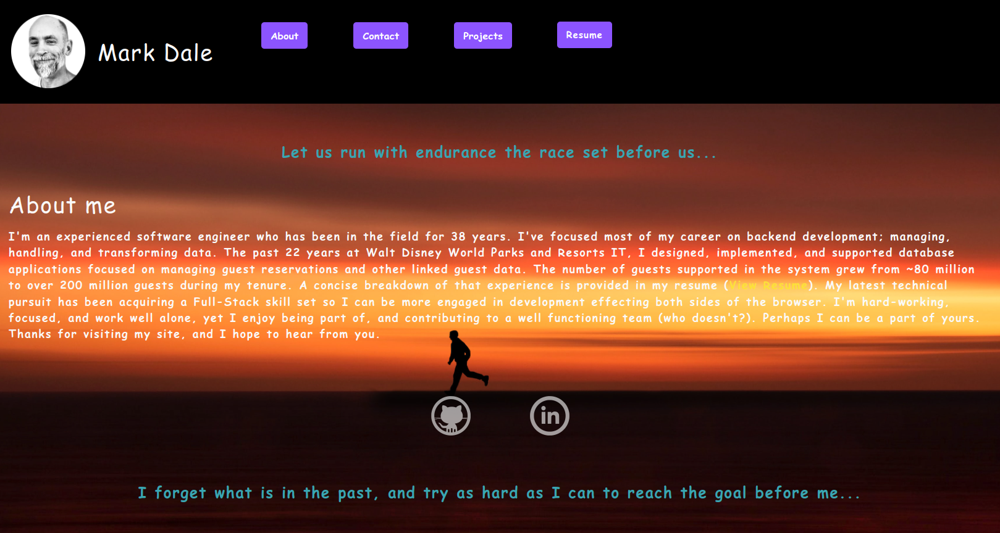

# UCF-Bootcamp Portfolio

UCF-Bootcamp coding challenges and team projects assigned to grade learning performance.

## Description

A React application that lists a set of coding projects collectively exhibiting the Full-Stack developer skillset,
as well providing an historical Resume that documents the last 20+ years of employment experience.   

## Table Of Contents

- [portfolio-msdale](#portfolio-msdale)
  - [Description](#description)
  - [Table Of Contents](#table-of-contents)
  - [Local Installation (only if executing on local server/pc)](#local-installation-only-if-executing-on-local-serverpc)
  - [Usage for deployed Installation](#usage-for-deployed-installation)
  - [Usage for local Installation](#usage-for-local-installation)
  - [Questions and Contack Links](#questions-and-contact-links)

## Local Installation (only if executing on local server/pc)

To install locally, clone this repository to your local environment. This is a React application, so Node and React must be installed. If you need to install Node, check out this link https://nodejs.org/en/download/. Once Node (and npm) are installed, attach to the repository root directory and type the following command:

**npm install**  
  
This command should install all Node and React modules necessary to execute the application.

## Usage for deployed Installation

To execute the application using the deployed application, click the following link:

https://msdale.github.io/portfolio-msdale/
  
The browser application interface should appear as pictured in the screenshot displayed above [Description](#description).

## Usage for local Installation

To execute the application locally, on your terminal/console connect to the root diretory in the cloned repository and type:

**npm start** 
  
or type

**npm run start**
  
The application interface will be available in your browser as:

http://localhost:3000
  
The application must remain running in the terminal until your done with it, at which time you can terminate it with a CTRL-C keystroke.

## Questions - Contack Links

Any questions, please contact Mark Dale.

My email address is: msdaledad@gmail.com  
My github profile is https://github.com/msdale  
[UCF-Grades](./src/assets/documents/UCF-Bootcamp-Grades.pdf)
